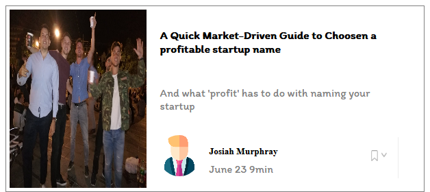

# css-integration

## reviewing all css learned with some scss to imitate cards, images

For my index, the point was to use some effect learned in the past and to try new glowing effect found on the internet and modified.

In the interface 2, I had to use some css fot the chart and some bootstrap for the card design.

Here is the exercice instructions : https://github.com/becodeorg/gnt-verou-1-26/tree/master/1.The-Field/4.HTML-CSS/5.End-of-Field/1.Trial-Run.

Here is my index page , in order two link the two first mandatories exercices, which is made with glowing effect found on the internet and redesigned.: https://adrienclesse.github.io/css-integration/.

Here is the first interface, for which I used different icons and font-family than in the istruction but the responsivess work is a great success, even for mobile phone : https://adrienclesse.github.io/css-integration/interface1.html

Here is the second interface : only problem met was about using transformation, or justify content to invert my chart's forms : https://adrienclesse.github.io/css-integration/interface2.html

I used a lot of grid and flex to design my third interface , which is an additional exercice. Here is the result :  

Pleas enjoy the result, was a great pleasure to program!
